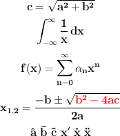

# Equation Editor
The equation editor is a simple dialog that allows you to insert equations into a page using **latex**.

In order to be able to use this plugin you must have latex installed and the following two commands must be available on your system: "``latex"`` and "``dvipng"``. You can control the look of the equations using the special template "``_Equation.tex"``. The only variable that can be used in this template is "``equation``", which will be replaced with the content from the dialog.

**Dependencies:** This plugin requires a Latex suite to be installed as well as the "dvipng" application. In specific the "latex" and "dvipng" commands should be available in the system path.

Syntax
------

Some quick examples of the latex math syntax. For a complete reference see the links below:

	c = \sqrt{ a^2 + b^2 }
	
	\int_{-\infty}^{\infty} \frac{1}{x} \, dx
	
	f(x) = \sum_{n = 0}^{\infty} \alpha_n x^n
	
	x_{1,2}=\frac{-b\pm\sqrt{\color{Red}b^2-4ac}}{2a}
	
	\hat a  \bar b  \vec c  x'  \dot{x}  \ddot{x}

References
----------

* Micheal Downes, *Short Math Guide for LaTeX*, American Mathematical Society, 2002  [1]
* Tobias Oetiker e.a, *The Not So Short Introduction to LATEX2e*, 2007  [2]

* [1] <http://www.ams.org/tex/amslatex.html>
* [2] <http://www.latex-project.org/guides/>
* <http://en.wikipedia.org/wiki/Help:Formula> (latex parts only)

