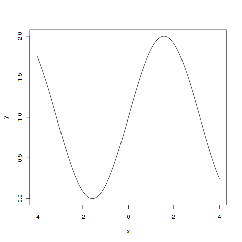
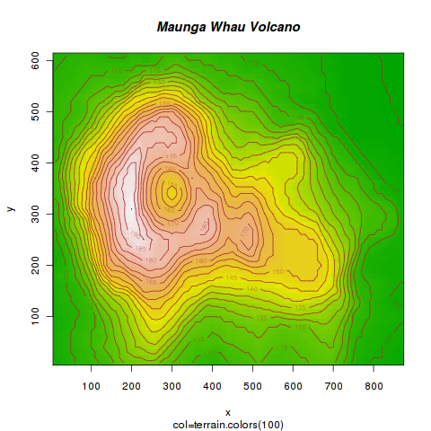

# GNU R Plot Editor
The GNU R plot editor is, as its name suggests, a simple dialog that allows you to insert plotting scripts in GNU R's 'S' language.

**Dependencies:** This plugin requires GNU R to be installed.  For specific notebooks which others have created, bear in mind that they may have used GNU R with additional libraries installed.  In this case, as well as GNU R, you will need the same libraries installed that others used.

On Ubuntu the package to install is "``r-base``".

Syntax
------

Some quick examples of the GNU R syntax.  For a complete reference see the links below.

	x = seq(-4,4,by=0.01)
	y = sin(x) + 1
	plot(x,y,type='l')

	# Maunga Whau Volcano Example
	# Copyright (c) //R Development Core Team [5]//
	x <- 10*(1:nrow(volcano)); x.at <- seq(100, 800, by=100)
	y <- 10*(1:ncol(volcano)); y.at <- seq(100, 600, by=100)
	
	# Using Terrain Colors
	
	image(x, y, volcano, col=terrain.colors(100),axes=FALSE)
	contour(x, y, volcano, levels=seq(90, 200, by=5), add=TRUE, col="brown")
	axis(1, at=x.at)
	axis(2, at=y.at)
	box()
	title(main="Maunga Whau Volcano", sub = "col=terrain.colors(100)", font.main=4)

Plot size
---------

This plugin will generate an image which is exactly 480x480 pixels. You can tweak the produced image size by incerting a comment in your script:

	# WIDTH = 960
	# HEIGHT = 480
	plot(c(0,1),c(100,328))

You can define only one of the two variable and the other will be set to the default value of 480 pixels. The line should start with the comment sign '#'. Spaces between words are not important.

Features Available
------------------

Be aware that this plugin pre-sets the png device to render graphics.  For that reason, you should not try to use the other device commands (or to redefine the png device command).  For example, the 3d plotting devices that render to OpenGL rather than png should not be used, nor should the jpg output.

Aside from this, most of R's advanced plotting power should be available to you.

References
----------

* An Introduction to R [1]
* The R Website [2]
* The R Wiki [3]

* [1] <http://cran.r-project.org/doc/manuals/R-intro.html>
* [2] <http://www.r-project.org/index.html>
* [3] <http://rwiki.sciviews.org/>
* [4] <http://cran.r-project.org/banner.shtml>
* [5] <http://gallery.r-enthusiasts.com/>

