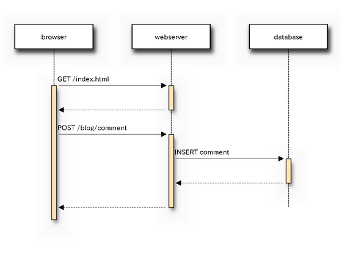

# Sequence Diagram Editor
The sequence diagram editor allows you to insert and edit diagrams based on seqdiag. Seqdiag uses a basic script language to define diagrams. This plugin adds a dialog where one can define a diagram in this script. The dialog shows a preview of the rendered diagram and when the diagram is finished it can be inserted in a zim page as an image. You can always edit it later again by selecting "Edit Diagram" from the context menu (right-mouse-click on the diagram will show the context menu).

**Dependencies:** This plugin requires "seqdiag" to be installed and available in the system path.

To install the "seqdiag" tool, use ``easy_install`` or ``pip``:

``$ sudo easy_install seqdiag``

Or

``$ sudo pip seqdiag``

Example
-------

For example a diagram like:

Can be created by entering the following definition in the dialog:

	diagram {
	  browser  -> webserver [label = "GET /index.html"];
	  browser <-- webserver;
	  browser  -> webserver [label = "POST /blog/comment"];
	              webserver  -> database [label = "INSERT comment"];
	              webserver <-- database;
	  browser <-- webserver;
	}

For full documentation of the script language see: <http://blockdiag.com/en/seqdiag/index.html>

